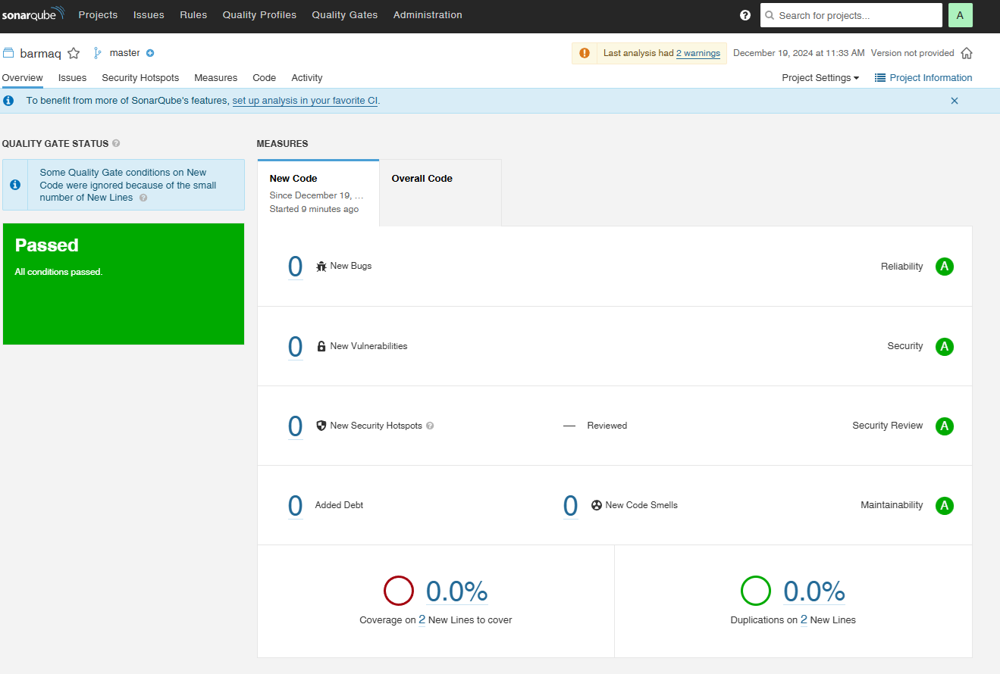

# Домашнее задание к занятию 9 «Процессы CI/CD»


## Знакомоство с SonarQube

### Основная часть

1. Создайте новый проект, название произвольное.
2. Скачайте пакет sonar-scanner, который вам предлагает скачать SonarQube.
3. Сделайте так, чтобы binary был доступен через вызов в shell (или поменяйте переменную PATH, или любой другой, удобный вам способ).
4. Проверьте `sonar-scanner --version`.
5. Запустите анализатор против кода из директории [example](./example) с дополнительным ключом `-Dsonar.coverage.exclusions=fail.py`.
6. Посмотрите результат в интерфейсе.
7. Исправьте ошибки, которые он выявил, включая warnings.
8. Запустите анализатор повторно — проверьте, что QG пройдены успешно.
9. Сделайте скриншот успешного прохождения анализа, приложите к решению ДЗ.

### Решение
1. создаем проект barmaq, добавляем токен
2. качаем и ставим сонар. у меня в винду
*   https://docs.sonarsource.com/sonarqube-server/latest/analyzing-source-code/scanners/sonarscanner/
3. добавляем в PATH
*   setx PATH "%PATH%;C:\Users\victorsh\Documents\sonar-scanner-6.2.1.4610-windows-x64\bin"
4. sonar-scanner --version  
```   11:53:20.928 INFO  Scanner configuration file: C:\Users\victorsh\Documents\sonar-scanner-6.2.1.4610-windows-x64\bin\..\conf\sonar-scanner.properties
   11:53:20.931 INFO  Project root configuration file: NONE
   11:53:20.947 INFO  SonarScanner CLI 6.2.1.4610
   11:53:20.949 INFO  Java 17.0.12 Eclipse Adoptium (64-bit)
   11:53:20.950 INFO  Windows 11 10.0 amd64
```
5. запускаем
*   sonar-scanner.bat -D"sonar.projectKey=barmaq" -D"sonar.sources=." -D"sonar.host.url=http://89.169.146.8:9000" -D"sonar.login=<token>" -D"sonar.coverage.exclusion=fail.py
6. смотрим результат в вебинтерфейсе
7. испрвляем :

```def increment(index=0):
    index += 1
    return index
def get_square(numb):
    return numb*numb
def print_numb(numb):
    print("Number is {}".format(numb))

index = 0
while (index < 10):
    index = increment(index)
    print(get_square(index))
```
8. запускаем повторно
9.
    
  
    
## Знакомство с Nexus

### Основная часть

1. В репозиторий `maven-public` загрузите артефакт с GAV-параметрами:

 *    groupId: netology;
 *    artifactId: java;
 *    version: 8_282;
 *    classifier: distrib;
 *    type: tar.gz.
   
2. В него же загрузите такой же артефакт, но с version: 8_102.
3. Проверьте, что все файлы загрузились успешно.
4. В ответе пришлите файл `maven-metadata.xml` для этого артефекта.

### Знакомство с Maven

### Подготовка к выполнению

1. Скачайте дистрибутив с [maven](https://maven.apache.org/download.cgi).
2. Разархивируйте, сделайте так, чтобы binary был доступен через вызов в shell (или поменяйте переменную PATH, или любой другой, удобный вам способ).
3. Удалите из `apache-maven-<version>/conf/settings.xml` упоминание о правиле, отвергающем HTTP- соединение — раздел mirrors —> id: my-repository-http-unblocker.
4. Проверьте `mvn --version`.
5. Заберите директорию [mvn](./mvn) с pom.

### Основная часть

1. Поменяйте в `pom.xml` блок с зависимостями под ваш артефакт из первого пункта задания для Nexus (java с версией 8_282).
2. Запустите команду `mvn package` в директории с `pom.xml`, ожидайте успешного окончания.
3. Проверьте директорию `~/.m2/repository/`, найдите ваш артефакт.
4. В ответе пришлите исправленный файл `pom.xml`.

---

### Как оформить решение задания

Выполненное домашнее задание пришлите в виде ссылки на .md-файл в вашем репозитории.

---
